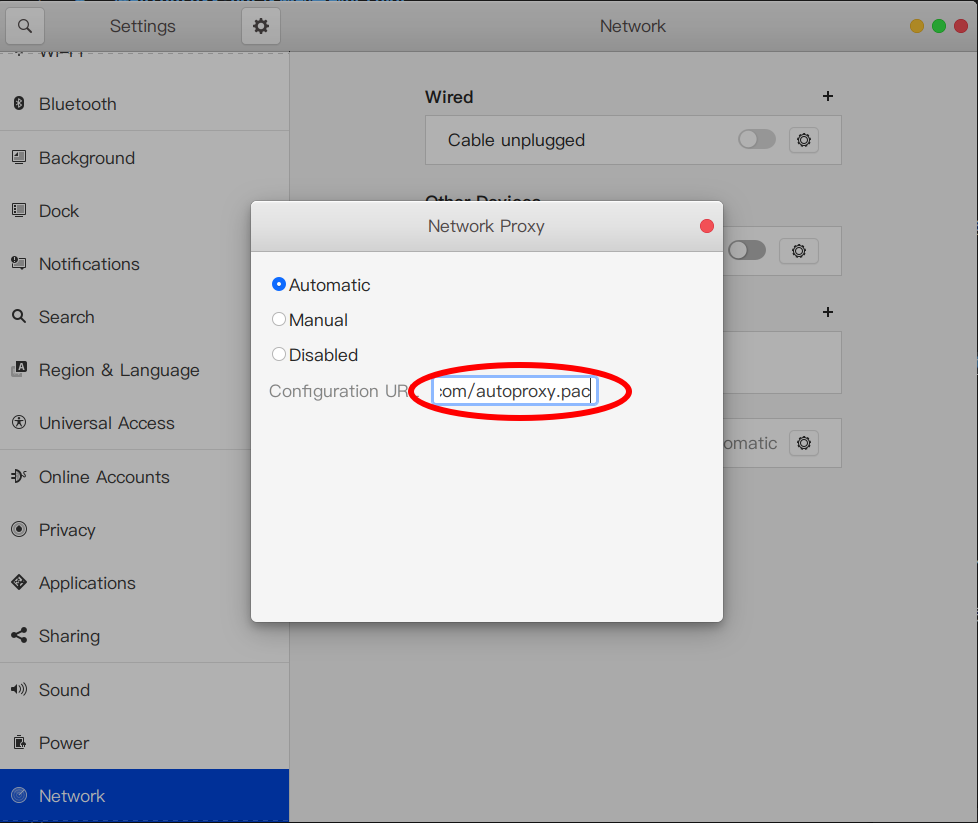
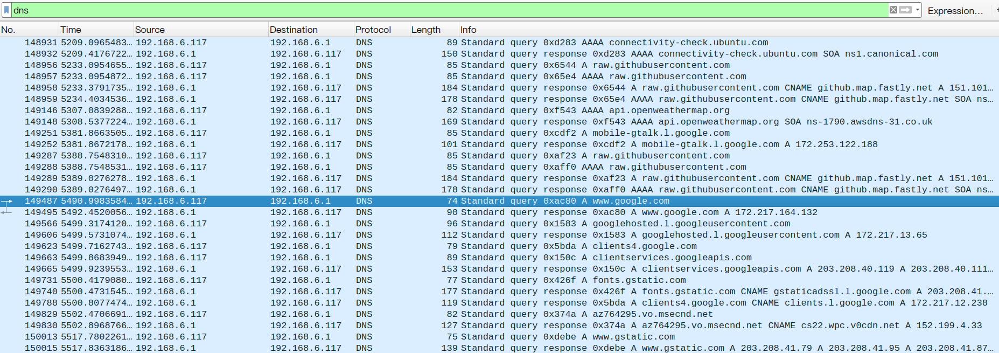

# 一键Autoproxy.pac快速部署到Heroku

自动根据gfwlist生成Autoproxy.pac

点击下面按钮部署：

- - -
- - -

## 0. 注意

部署需要注册heroku帐号，注册heroku帐号时需要梯子（否则验证码刷不出来），需要一个能正常接收验证码的邮箱（@qq.com，@163.com都不行），有条件gmail
最好，没条件这里推荐outlook <https://login.live.com/>。

## 1. 验证

部署后，点 open app,能正常显示网页，地址补上PAC_PATH后(例如：<https://test.herokuapp.com/autoproxy.pac>)访问显示pac配置。

## 2. 系统设置

以Ubuntu系统为例，点击系统设置->网络->代理设置->自动，在输入框中输入https://test.herokuapp.com/autoproxy.pac 。

配置后浏览器不需要使用SwitchyOmega再进行配置。

配合插件[proxy-switcher](https://extensions.gnome.org/extension/771/proxy-switcher/)食用效果更佳！

Windows、Mac类似。

## 3. 为什么需要？

1. 使用SwitchyOmega进行分流，虽然sockets5支持远程DNS解析，抓包发现还是会向本地DNS发送请求，会导致很多问题。

2. 由于Chrome移除对file://和data:协议的支持, 使用本地设置file://path/to/your/pac Chrome无法正常使用。

3. 自动更新（每天自动更新到最新）。

## 4. 公共使用

本地代理： SOCKS5 127.0.0.1:1081

尽量还是自己部署一个，herokuapp限制时长。

https://perl1024.herokuapp.com/autoproxy.pac

## 致谢

https://github.com/JinnLynn/genpac

https://github.com/gfwlist/gfwlist
